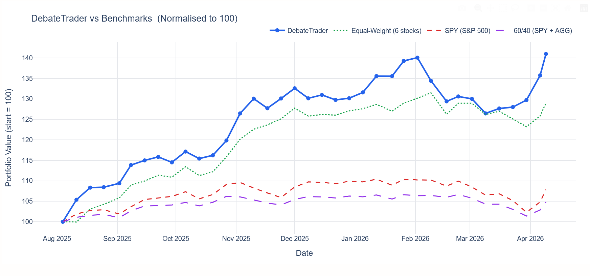

# DebateTrader: A Multi-Agent LLM Framework with Structured Bull–Bear Debate for Stock Trading

---

## Abstract

DebateTrader is a multi-agent framework for stock trading that introduces structured debate into the decision-making process. While large language model (LLM)-based systems can flexibly integrate diverse financial information, most existing approaches rely on a single agent to generate signals, which can lead to confirmation bias and limited evaluation of conflicting evidence.

To address this, DebateTrader decomposes trading decisions into multiple stages. Specialized analyst agents first generate structured signals from different data sources, including technical indicators, company fundamentals, macroeconomic conditions, news sentiment, and retail attention signals. These modules combine deterministic feature extraction with constrained LLM synthesis where appropriate, producing standardized JSON artifacts for downstream reasoning. A Bull agent and a Bear agent then construct opposing investment arguments, followed by a Judge agent that determines the final decision. At the portfolio level, a separate agent evaluates all assets jointly and allocates capital based on relative conviction. A rule-based risk management layer then applies portfolio constraints before the final allocations are evaluated through backtesting.

The system is evaluated on a curated universe of six S&P 500 stocks using a historical backtesting framework with weekly rebalancing. The evaluation compares DebateTrader against an equal-weight six-stock portfolio, SPY buy-and-hold, and a 60/40 SPY/AGG allocation using total return, annualized return, Sharpe ratio, maximum drawdown, win rate, and average weekly return. This controlled setting allows us to focus on system behavior and decision quality. In a 36-week backtest from August 2025 to April 2026, DebateTrader achieved the highest raw return among the compared strategies, while also revealing important risk and scalability trade-offs: its Sharpe ratio was slightly below the equal-weight benchmark and its maximum drawdown was higher than all benchmarks.

---

## 1. Introduction

Stock trading requires synthesizing information from multiple sources, including price movements, company fundamentals, macroeconomic conditions, and market sentiment. Traditional quantitative approaches rely on predefined features and statistical models, which often struggle to incorporate unstructured data such as news or narrative signals. With the emergence of large language models (LLMs), it has become possible to reason over heterogeneous data in a more flexible way.

Despite this progress, most LLM-based trading systems rely on a single-agent design, where one model produces the final decision. This setup introduces a key limitation: the model may exhibit confirmation bias and lacks mechanisms for internal critique or comparison.

This project explores whether structured disagreement can improve decision quality. We propose DebateTrader, a multi-agent framework that separates trading decisions into independent analysis, adversarial argumentation, and final judgment. Multiple analyst agents first generate signals from different data modalities, after which a Bull and Bear agent construct opposing perspectives that are evaluated by a Judge agent.

Beyond individual decisions, we also consider portfolio-level reasoning. Instead of assigning weights independently, the system evaluates all assets jointly and allocates capital based on relative conviction, which better reflects real-world investment decision-making.

To enable detailed analysis, we restrict the evaluation to a curated universe of six S&P 500 stocks, each representing a different sector. This allows us to focus on system behavior and decision processes rather than large-scale optimization.

---

## 2. Related Work

Existing work on AI-driven trading systems can be broadly grouped into traditional quantitative models, machine learning approaches, and more recent LLM-based methods. Classical approaches such as factor models (Fama and French, 1993) and time-series forecasting methods such as ARIMA (Box et al., 2015) rely on structured numerical data and predefined assumptions. While these methods are often interpretable, they are limited in incorporating unstructured information such as textual sentiment.

Recent work explores the use of LLMs for financial reasoning, including summarizing earnings reports, extracting sentiment from news, and generating trading signals (Wu et al., 2023; Yang et al., 2023). These approaches benefit from flexible reasoning but are typically built on a single-agent framework, which lacks mechanisms for evaluating conflicting evidence.

Multi-agent systems provide an alternative by decomposing complex reasoning tasks into specialized components (Wooldridge, 2009). In particular, recent work shows that structured interaction among multiple agents can improve reasoning quality and factual consistency (Du et al., 2023; Park et al., 2023). However, most prior work focuses on general reasoning or simulation environments rather than domain-specific applications such as finance.

DebateTrader extends these ideas to financial decision-making by combining multi-source data with structured bull–bear debate and introducing portfolio-level reasoning. This design allows the system to compare assets directly and produce differentiated allocations.

---

## 3. System Architecture

DebateTrader follows a modular multi-agent architecture, as illustrated in Figure 1. The system separates data processing, analysis, reasoning, and execution into distinct stages, allowing each component to operate independently.

The pipeline begins with a data layer that collects information from multiple sources, including market prices, financial statements, macroeconomic indicators, and news data. These inputs are transformed into structured feature snapshots that represent the information available at a given point in time, ensuring consistency across agents and avoiding future data leakage.

In the analysis stage, specialized agents evaluate each stock from different perspectives. The technical analyst focuses on price-based indicators such as trends and momentum, while the fundamental analyst evaluates financial performance and balance sheet health. Additional agents incorporate macroeconomic signals and news-driven sentiment. Each agent produces a structured output containing a signal, confidence score, and supporting evidence.

These outputs are then passed to a debate stage, where a Bull agent constructs a positive case and a Bear agent constructs a negative case. After a structured rebuttal process, a Judge agent evaluates both sides and produces a final decision.

The system then performs portfolio-level reasoning by evaluating all assets jointly and assigning weights based on relative conviction. Finally, a risk management module applies constraints such as position limits and sector exposure, and the strategy is evaluated through backtesting.

### Figure 1. System Architecture

```

+---------------------------------------------------------------+
|                STOCK UNIVERSE (Demo)                          |
|  6 S&P 500 stocks spanning 6 GICS sectors                    |
|  AAPL, AMZN, BRK.B, GOOGL, LLY, XOM                         |
+------------------------------+--------------------------------+
|
+------------------------------v--------------------------------+
|                      DATA LAYER                               |
|     yfinance   SEC EDGAR   FRED   Finnhub   Google Trends     |
+------------------------------+--------------------------------+
|
+------------------------------v--------------------------------+
|                  ANALYST TEAM (parallel)                      |
|  Fundamental | Technical | Macro | News & Trend               |
+------------------------------+--------------------------------+
|
+------------------------------v--------------------------------+
|               DEBATE STAGE (Bull vs Bear + Judge)             |
+------------------------------+--------------------------------+
|
+------------------------------v--------------------------------+
|          PORTFOLIO JUDGE (cross-ticker)                       |
+------------------------------+--------------------------------+
|
+------------------------------v--------------------------------+
|           RISK MANAGEMENT + BACKTEST                          |
+---------------------------------------------------------------+

```

---

## 4. Data and Evaluation

The system integrates multiple data sources covering market prices, financial statements, macroeconomic indicators, and news signals. These sources provide complementary views of each asset and enable the model to capture both quantitative trends and information-driven signals.

The evaluation is conducted on a fixed universe of six large-cap U.S. equities selected from the S&P 500, each representing a different GICS sector: Apple (AAPL, Information Technology), Amazon (AMZN, Consumer Discretionary), Berkshire Hathaway (BRK.B, Financials), Alphabet (GOOGL, Communication Services), Eli Lilly (LLY, Health Care), and ExxonMobil (XOM, Energy). This setup ensures diversity while keeping the system manageable for detailed analysis. The goal is to study system behavior rather than optimize performance at scale.

A summary of the data sources is provided in Table 1.

**Table 1. Data Sources Used in DebateTrader**

| Source                     | Data Type                                               | Analyst                | Update Frequency | Access Method  |
| -------------------------- | ------------------------------------------------------- | ---------------------- | ---------------- | -------------- |
| Yahoo Finance (`yfinance`) | Historical OHLCV price data                             | Technical; Backtest    | Daily            | Python library |
| Yahoo Finance (`yfinance`) | Supplementary fundamental statements                    | Fundamental            | Quarterly        | Python library |
| SEC EDGAR (XBRL API)       | Financial statements (10-K, 10-Q)                       | Fundamental            | Quarterly        | REST API       |
| FRED (`fredapi`)           | Macroeconomic indicators                                | Macro                  | Monthly          | Python library |
| Finnhub News API           | Company news data                                       | News & Trend           | Daily            | REST API       |
| Google Trends (`pytrends`) | Retail attention signals                                | News & Trend           | Daily for short historical windows | Python library |

All data is preprocessed to ensure temporal alignment. Financial data is filtered using the filing date rather than the reporting period end date, preventing the use of future information and avoiding look-ahead bias. The processed data is converted into structured feature snapshots representing the information available at each decision point.

The system is evaluated using a historical backtesting framework with weekly rebalancing over the period from August 2025 to April 2026. At each step, the model generates signals, constructs a portfolio, and simulates returns based on subsequent market data.

Performance is compared against baseline strategies including SPY buy-and-hold, an equal-weight portfolio, and a 60/40 allocation. Evaluation metrics include Sharpe ratio, maximum drawdown, and win rate, capturing both return and risk characteristics.

**Table 2. Backtest Performance Summary**

| Metric | DebateTrader | Equal-Weight | SPY B&H | 60/40 |
|---|---:|---:|---:|---:|
| Total return | +41.00% | +29.01% | +7.86% | +4.81% |
| Annualized return | +64.26% | +44.47% | +11.55% | +7.02% |
| Sharpe ratio (annualized) | 3.0521 | 3.0670 | 1.1369 | 1.0892 |
| Max drawdown | 9.72% | 6.29% | 7.32% | 4.94% |
| Win rate | 72.2% | 72.2% | 55.6% | 52.8% |
| Average weekly return | +0.9850% | +0.7241% | +0.2198% | +0.1343% |



**Figure 2. Backtest equity curve.** Normalized portfolio value over time for DebateTrader, the equal-weight six-stock benchmark, SPY buy-and-hold, and the 60/40 benchmark from 2025-08-04 to 2026-04-09.

Table 2 summarizes the final backtest results, while Figure 2 shows the normalized portfolio value over time for DebateTrader and the benchmark strategies. These results are discussed in Section 7.

## 5. Models and Technologies

### 5.1 Model Usage and Design Choices
DebateTrader uses a hybrid design in which rule-based computation and LLM reasoning serve distinct roles at each stage. The analyst layer combines fully rule-based modules with hybrid modules that call an LLM only for final synthesis. The debate and portfolio stages rely more heavily on LLM reasoning for argumentation, cross-ticker comparison, and judgment. The risk management stage is primarily rule-based, applying deterministic portfolio constraints before generating an optional LLM commentary.

#### Analyst Team
The analyst stage consists of four specialized modules. The technical and fundamental analysts follow a hybrid pattern: rule-based logic first extracts bullish factors, bearish factors, and risk flags from structured feature inputs, which are then passed to an LLM to synthesize a final signal, confidence score, and summary. The macro and news & trend analysts are fully rule-based, determining the final signal through a scored comparison of bullish and bearish evidence without any LLM call.

The technical analyst evaluates price-based indicators including SMA-20, SMA-50, EMA-12, EMA-26, RSI-14, MACD, 5-day and 20-day returns, 20-day volatility, and relative volume. The fundamental analyst evaluates P/E ratio (TTM and forward), revenue and earnings growth, gross, operating, and net margins, debt-to-equity, current and quick ratios, ROE, ROA, free cash flow, and dividend yield. The macro analyst scores conditions across indicators including the Fed funds rate, 10-year Treasury yield, yield curve spreads, VIX, credit spreads, GDP growth, unemployment, inflation, and financial stress index. The news & trend analyst evaluates article count, positive and negative article share, average LM sentiment score, uncertainty and litigious language flags, and Google Trends week-over-week search interest change.

All four modules output standardized JSON reports with uniform fields — signal, confidence, summary, bullish factors, bearish factors, risk flags, and key metrics — ensuring compatibility with downstream stages.

#### Debate & Portfolio Judge
The debate stage uses Groq-hosted Llama 3.1 8B Instant, while portfolio-level judgment uses Claude Sonnet 4.6 (`claude-sonnet-4-6`) via Anthropic. Both are accessed through a shared LLM client that supports provider selection by configuration. LLM calls use low temperature and JSON-oriented prompting to keep outputs structured and reduce variability.

Each weekly debate runs one round per ticker: the Bull agent first builds a case from all four analyst reports, the Bear agent then constructs a rebuttal with access to the Bull's case, and the Judge agent evaluates both sides to produce a final decision. The debate stage maintains lightweight local memory through JSON artifacts. The code defaults to a four-week lookback and a maximum of eight retained weeks; the final backtest used a three-week lookback and a maximum of six retained weeks. This memory provides continuity across weeks as background context, but prompts explicitly prohibit it from overriding current analyst evidence or introducing new current-week facts.

The portfolio judge receives the full debate transcripts for all six tickers in a single LLM call, which forces cross-ticker comparison and relative conviction-based weighting. Both the debate and portfolio stages include deterministic fallback behavior: if an LLM call fails, the debate stage falls back to rule-based case construction, and the portfolio judge falls back to a confidence-weighted allocation among bullish tickers.

The orchestration layer is implemented in custom Python scripts and does not use external agent frameworks such as LangChain or LlamaIndex. The system does not rely on embedding models, vector databases, or retrieval-augmented generation.

#### Risk Management
The risk management stage is primarily rule-based. After the portfolio judge produces weekly weights, the risk manager applies deterministic constraints, including single-position caps, sector caps, minimum-holdings requirements, defensive equal-weight mode, and iterative redistribution when caps are violated. An LLM is called only after these adjustments to generate a risk commentary over the final allocation and debate highlights.

Overall, the system emphasizes structured intermediate representations, constrained prompting, stage-specific model usage, and rule-based safeguards to keep the pipeline modular, interpretable, and operationally robust.

### 5.2 Infrastructure and Deployment Considerations
The system is implemented as a script-driven, batch-oriented research pipeline. It depends on several external services for data and model inference, including Yahoo Finance, SEC EDGAR, FRED, Finnhub, Google Trends, Groq, and Anthropic. Dependency management is handled through a pyproject.toml-based Python project setup with Hatchling build configuration and optional development dependencies. API keys and model selection are managed through environment variables. Raw inputs and intermediate artifacts are stored in Parquet, CSV, and JSON formats to support reproducibility and allow inspection at each stage. The pipeline is explicitly time-aware: historical reports are generated according to each data source's reporting frequency and date alignment rules, which maintains backtesting consistency and prevents information leakage. Overall, the technical stack prioritizes modularity and controlled experimentation over production deployment readiness.


## 6. Responsible AI Considerations
### 6.1 Bias and Fairness Analysis
Concerns regarding bias and fairness in the current system primarily relate to market coverage, data scope, and model behavior. First, the system is evaluated on a fixed sample of six large-cap U.S. stocks. Therefore, the resulting assessments and conclusions cannot be directly generalized to the broader stock market, and are more likely to reflect the behavior of companies with high liquidity, high media visibility, and large market capitalizations. Second, the system relies on a limited number of external data providers, which may introduce source-specific coverage bias or result in inconsistent information quality across different companies. Third, the system does not incorporate the full range of historical data prior to the testing period, which may lead it to understate the influence of major earlier market events on current output results. Finally, if the supplied evidence does not fully override the model's prior knowledge regarding well-known companies, such prior knowledge may still influence its judgments.

### 6.2 Hallucination and Factual Accuracy Controls
To mitigate the risk of hallucinations and improve factual accuracy, the system employs several practical safeguards. First, structured JSON outputs are used in all analytical and reasoning stages, rather than unrestricted free-form text. Additionally, the analyst layer uses a hybrid approach: rule-based logic extracts bullish and bearish factors from structured inputs, while the LLM is responsible only for synthesizing a final signal and summary from those pre-extracted factors. During the debate and judgment phases, prompts explicitly instruct the model to use only the provided inputs and prohibit the fabrication of facts or information. Furthermore, fallback logic helps maintain usable and bounded system behavior in the event of parsing failures or when model calls are unavailable. It should be noted, however, that while these measures reduce the generation of unsubstantiated content, they do not completely eliminate the risk of hallucinations.

### 6.3 Privacy Considerations
Privacy concerns with this system are relatively limited, as it primarily uses publicly available market, financial, macroeconomic, news, and search-interest data rather than individual user data. However, external LLM calls and stored transcripts or rationales still introduce limited data-governance and security considerations, so the current implementation should be viewed as a research prototype rather than a privacy-hardened production system.

### 6.4 Safety Measures and Ethical Implications
Safety and ethics are especially important because users may overtrust model-generated rationales, as the system produces signals, confidence scores, rankings, and portfolio allocations that may appear authoritative. To reduce this risk, the risk management layer applies deterministic constraints such as single-position caps, minimum-holdings requirements, defensive equal-weight mode, and allocation normalization before generating any LLM-based commentary. The project also remains within a paper-trading and backtesting setting rather than direct broker execution, which limits real-world operational risk.

## 7. Findings and Discussion
### 7.1 Key Insights

A key insight from building the system is that a staged pipeline becomes more manageable when each component produces structured intermediate outputs. DebateTrader separates analyst reports, bull–bear debate, portfolio judgment, risk management, and backtesting into distinct stages, which allows intermediate artifacts to be inspected and reused during debugging. This design was especially useful since the analyst modules produce standardized JSON reports with consistent fields, allowing downstream debate and portfolio components to consume heterogeneous inputs through a shared interface.

The debate stage also provided a useful layer of interpretability beyond the final trading signal. The bull and bear agents generated opposing cases with supporting evidence, counter-evidence, rebuttal points, and risk flags, while the judge preserved dissenting points from the weaker side in most decisions. This suggests that the debate mechanism helped expose competing interpretations of the same analyst evidence, rather than only producing a one-sided recommendation.

At the portfolio level, the system produced differentiated allocations rather than collapsing into an equal-weight strategy. Across the 36 weekly portfolio outputs, the portfolio judge generated 36 unique allocation patterns, with the number of non-zero holdings varying from 3 to 6 and averaging 4.53 per week. This indicates that the portfolio stage was able to perform relative comparison across tickers.

Finally, the backtest results provided an important evaluation insight: DebateTrader produced the strongest raw return among the compared strategies, but the result was not uniformly superior across all risk-adjusted metrics. This finding motivates a more careful discussion of performance trade-offs rather than a simple claim of overall outperformance.

### 7.2 Unexpected Challenges

One unexpected challenge was temporal alignment, especially after the debate memory mechanism was added. While the system already used time-aware selection for analyst inputs, such as using the latest available fundamental and macro reports before each weekly decision date, persistent cross-week memory introduced another possible source of look-ahead leakage. If memory from future weeks were reused when rerunning an earlier date, the historical decision process would no longer be clean. This issue was addressed by adding date-based filtering to the memory loading process, so that each weekly run can only access memory from prior weeks. This highlighted that, in multi-agent financial systems, temporal correctness must apply not only to market data but also to agent state.

The second challenge was the reliability of LLM calls across different stages. Model access, rate limits, or parsing failures can interrupt parts of the workflow since the pipeline depends on external model providers. To address this, several stages include deterministic fallback behavior. The debate and portfolio stages can still produce structured outputs when model calls fail, and the risk management stage can still apply portfolio constraints even when LLM-generated commentary is unavailable. As a result, fallback logic mainly served as an operational safeguard, helping the pipeline continue running even when model-dependent components were unstable.

The third challenge was connecting portfolio allocation with risk management. In the final run, the portfolio judge produced allocations below 100% in 14 of 36 weeks, which would create ambiguity for the backtesting stage. The risk manager addressed this by normalizing non-zero allocations before applying portfolio constraints. In the final run, most portfolio allocations already stayed within the predefined risk limits, so the risk layer did not need to make large structural changes. Its main role was to normalize under-allocated portfolios and verify that final weights satisfied the implemented constraints before backtesting.

### 7.3 Performance Trade-offs and Scalability

The final backtest results show why performance should not be evaluated by raw return alone. DebateTrader achieved a total return of 41.00% and an annualized return of 64.26%, outperforming the equal-weight, SPY buy-and-hold, and 60/40 benchmarks on raw return. However, its Sharpe ratio of 3.0521 was slightly below the equal-weight benchmark, and its maximum drawdown reached 9.72%, which was higher than all benchmarks. This suggests that the system produced a strong short-horizon return result, but not uniform superiority across all risk-adjusted metrics.

Scalability is another important consideration. The current implementation is evaluated on a controlled six-stock universe, which made it easier to inspect agent outputs, compare allocation decisions, and debug the pipeline. However, scaling the system to a broader stock universe would increase the number of analyst reports, debate calls, memory records, and portfolio-level comparisons that must be processed each week. This would increase computational cost, latency, and artifact-management complexity, especially in stages that rely on LLM calls.

The system also reflects a trade-off between interaction depth and execution cost. In the final backtest configuration, debate memory was limited with `--memory-lookback 3` and `--memory-max-weeks 6`, and the debate process used a single-round structure rather than multiple rounds of rebuttal. Even under this constrained setup, the debate stage still required meaningful computational resources. In runs with a Groq-hosted Llama 3.1 model, one week of debate could take tens of minutes, with token usage on the order of tens of thousands of tokens. These choices kept the weekly pipeline more manageable while allowing agents to incorporate recent historical context and opposing arguments. However, they also limited the amount of prior context and iterative debate that could influence each decision. As the system scales to more stocks or longer histories, this balance between richer agent interaction and efficient execution would become more important.

## 8. Conclusion and Future Work
In summary, this project develops a hybrid multi-stage framework for stock analysis and portfolio construction that combines structured analyst modules, adversarial debate, portfolio-level judgment, risk management, and backtesting within a single pipeline. Its main contribution is not merely the use of LLMs, but the integration of structured evidence extraction, debate-based comparison, and rule-based safeguards into one coherent system. Through this design, the project provides a prototype approach to combining modular analysis, comparative decision-making, and controlled portfolio construction in a research-oriented setting.

The current implementation also has several important limitations. The system is evaluated on a fixed universe of six large-cap U.S. stocks, so its findings should not be treated as directly representative of the broader market. In addition, the debate memory mechanism remains lightweight and local, rather than a more systematic long-horizon memory design. The system also continues to rely on limited external data sources and does not include a dedicated factual-verification layer beyond prompt constraints, structured outputs, and fallback logic. Finally, the backtesting setup remains simplified and does not incorporate transaction costs, slippage, taxes, or live execution frictions, which limits the system's real-world applicability.

The future directions for improving this project are relatively clear. One is to expand the stock universe to include more companies, industries, and market-cap levels, so that the system can be tested under broader market coverage and more varied information conditions. Another direction is to evaluate the debate process more systematically, including the quality and consistency of bull and bear arguments, as well as their actual contribution to final portfolio decisions. In addition, it would be valuable to introduce more realistic investment constraints in the portfolio and risk stages, including transaction costs, tax assumptions, etc.

## References

Fama, E. F., & French, K. R. (1993). Common risk factors in the returns on stocks and bonds. Journal of Financial Economics.

Box, G. E. P., Jenkins, G. M., Reinsel, G. C., & Ljung, G. M. (2015). Time Series Analysis: Forecasting and Control. Wiley.

Wu, S., et al. (2023). BloombergGPT: A Large Language Model for Finance. arXiv.

Yang, Y., et al. (2023). FinGPT: Open-Source Financial Large Language Models. arXiv.

Wooldridge, M. (2009). An Introduction to MultiAgent Systems. Wiley.

Du, Y., Li, S., Torralba, A., Tenenbaum, J., & Mordatch, I. (2023). Improving Factuality and Reasoning in Language Models through Multiagent Debate. arXiv.

Park, J. S., et al. (2023). Generative Agents: Interactive Simulacra of Human Behavior. arXiv.
